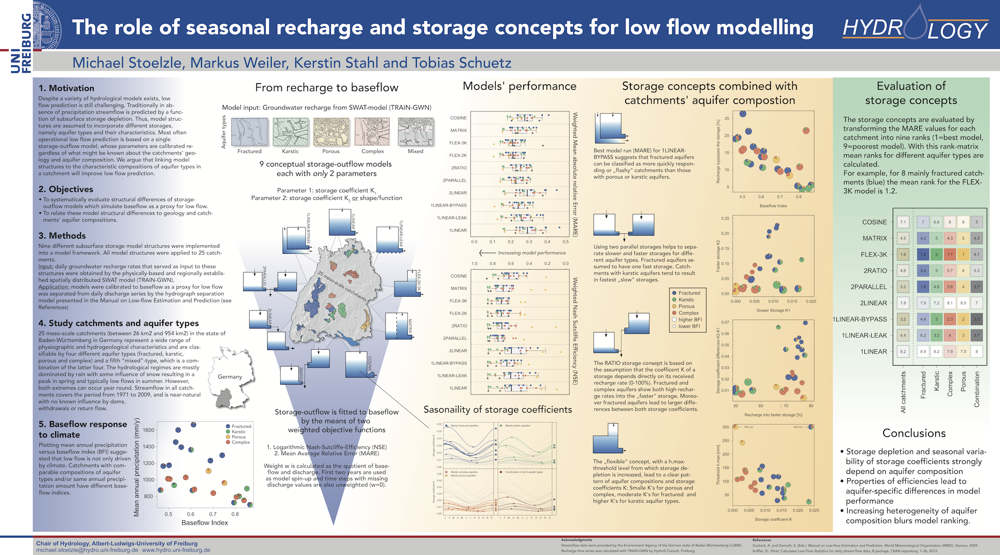

## EGU 2013

### Abstract

The main ideas of this study was to link geology to hydrological model structure. If the variability in (hydro-)geology is a first order control of baseflow variability then different groundwater model structure should be helpful to improve the translation from recharge into dry weather streamflow (=baseflow).

