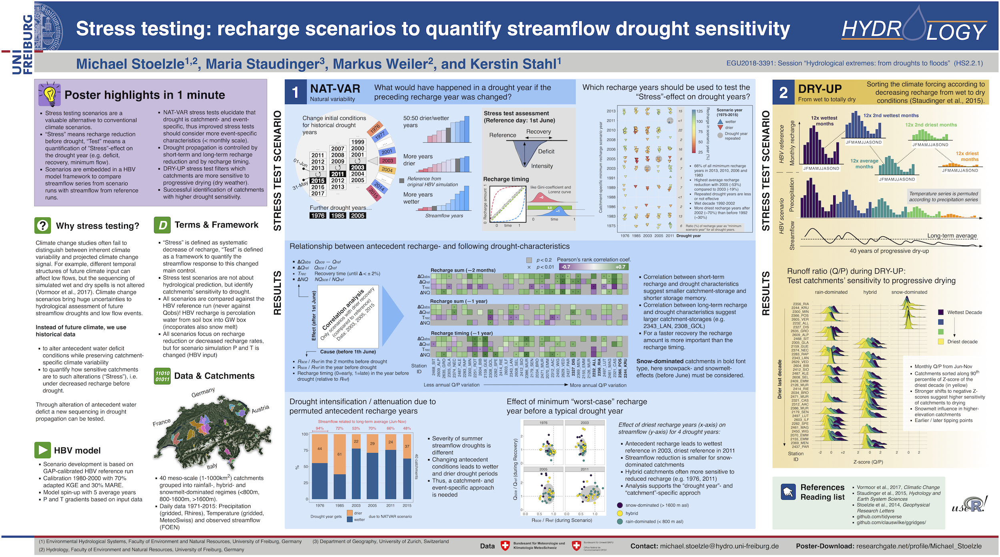
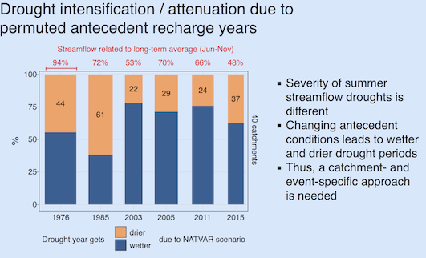

## EGU 2018

### Abstract
Climate change scenarios are often weak in changing the inherent variability of climate forcing. To test the effect of changed climate variability on drought propagation a framework of stress testing scenarios is developed. This model framework gives us the possibility to quantify catchments' response to altered antecedent conditions. Fopr streamflow a baseline references run is simulated in HBV (Q_ref) and than compared to specific scenario runs (Q_sce). As climate signal is mainly simoustanouly shaped by the variability of precipitation and temperature we focus in these stress testing scenarios on a more comprehensive variable to assess drought sensitivity: the recharge.

## Details
This graphs shows the effect of altered antecedent recharge years on specfific drought years. The question here is whether the catchments get drier or wetter due to the alteration.

