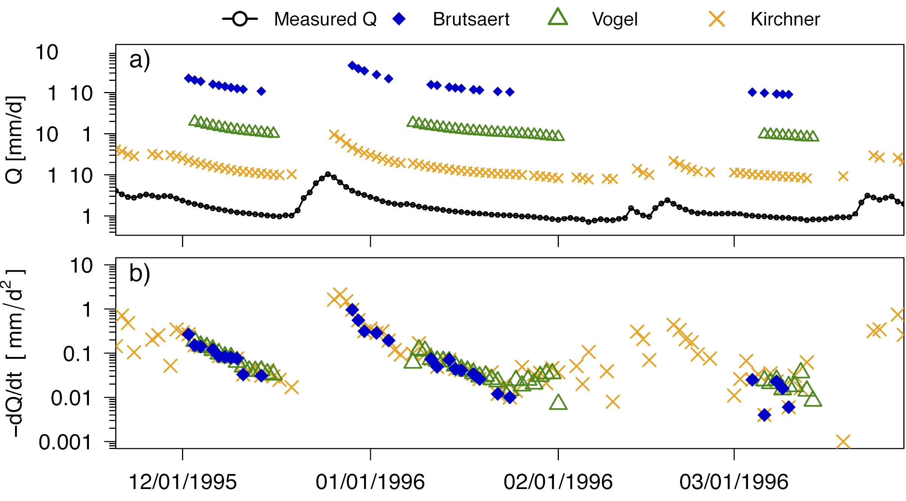

## Abstract

Nature and society are affected by droughts and low flows even in a water-rich region like Baden-Wuerttemberg in Southern Germany. Low flow is a result of water depletion of surface and subsurface reservoirs during times of low or no precipitation. This depletion is visible in the recession limb of the hydrograph. Streamflow during drought flow recession is hence a proxy to understand the drainage behavior of the storages in a catchment. 

In this study three storage-streamflow relationships were derived from streamflow recessions of six meso-scale catchments. Different approaches exist to fit regressions through plots of streamflow versus its daily rate of change. Three were tested to evaluate whether the fitted parameters can provide the core of a simple, conceptual model for low flow prediction. We found, that the differences in these predictions highlight the variability caused by the different recession analysis methods. In fact this variability may mask a specific catchments storage-outflow due to physiography and hydrogeology. 

_Figure:_

See also corresponding conference paper [here](HYA00048-00420.pdf)
