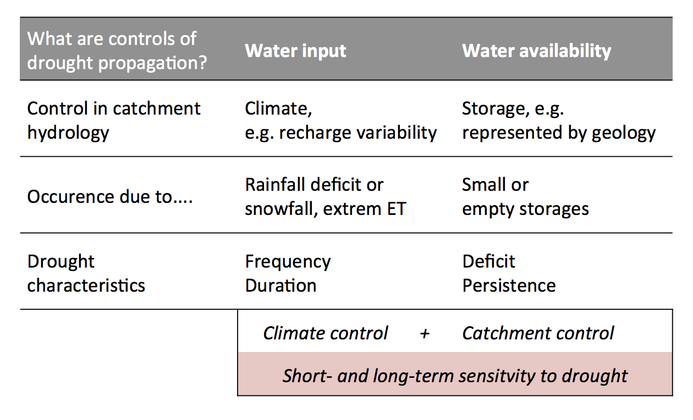

## Abstract

Streamflow drought depends to a large degree on groundwater recharge and storage depletion. During prolonged dry spells inherent catchment characteristics such as physiography and geology may be significant descriptors of streamflow response and baseflow-relevant subsurface processes. To better predict and preempt potential streamflow droughts, the relationship between recharge deficit and streamflow response needs to be studied more systematically. 

 * We present a model experiment with a combined SVAT (soil-vegetation- atmosphere transfer) and conceptual groundwater model that applies a novel set of recharge scenarios to simulate preceding recharge drought events in humid-temperate catchments with different dominant aquifer types. The scenarios are based on (i) the permutation of historical time series and (ii) a modified time series to match an extreme (50-year) drought event. 

 * Different functional relationships between preceding recharge deficit and baseflow response in specific drought years provided evidence that the aquifer-specific sensitivity to streamflow drought can be classified as more climate- or more catchment-controlled.

[Presentation PDF](HYPER2014_Stoelzle_et_al.pdf)

Corresponding Paper https://doi.org/10.1002/2014GL061344 
