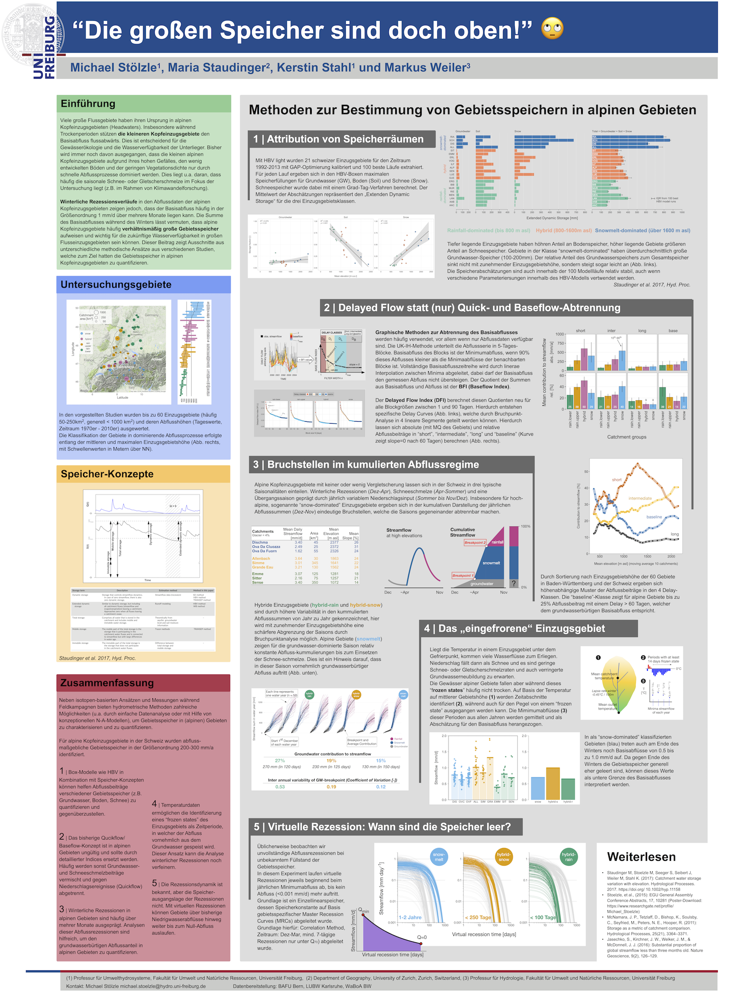

## 2. Workshop zur Alpinen Hydrologie, November 2017, Obergurgl (AT)

**Stoelzle et al.**

This poster shows a collection of innovative hydrological methods to estimate catchment storage in alpine environments.
Surprisingly catchment storage is not decreasing with increased catchment elevation.

