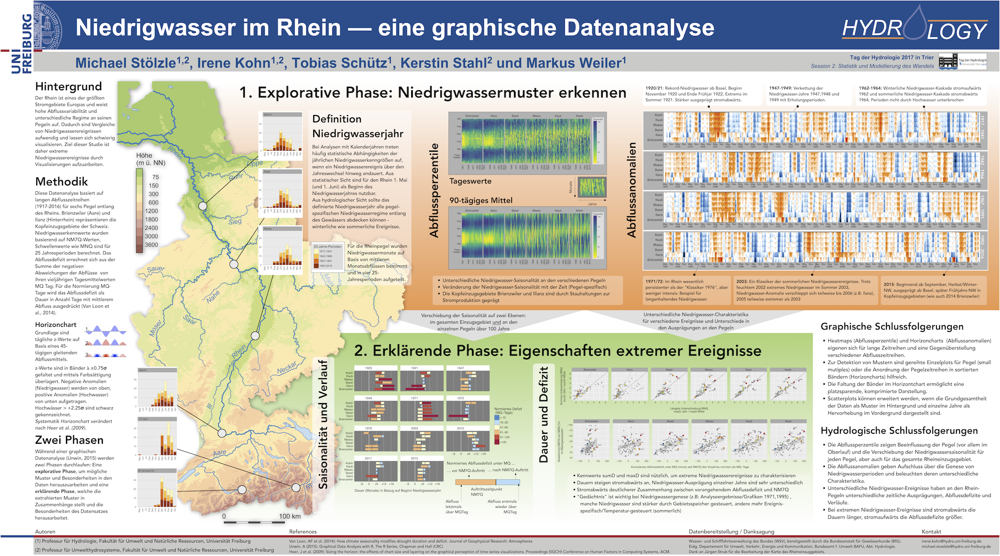
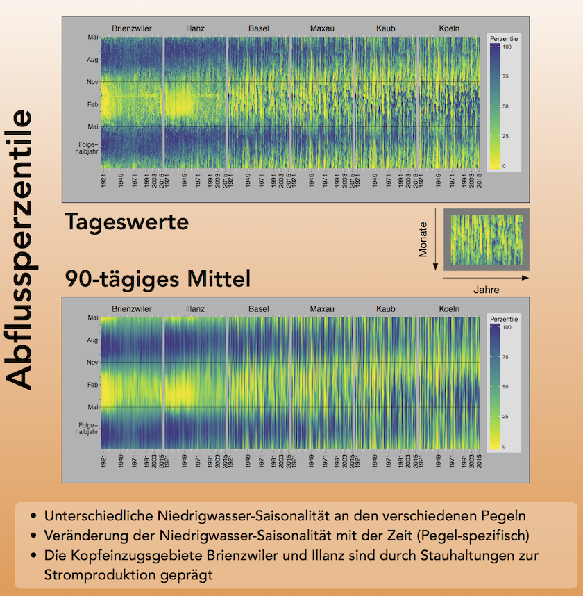

## TdH 2017

TdH = Tag der Hydrologie (German conference about Hydrology)

### Aim
Aim of the poster contribution was to encourage researchers to use explorative data analysis to investigate environmental changes over time. Some examples are shown how a explorative data analysis could look like.

Focus more on percentiles of discharge. On the left side are the headwater stations (e.g. Brinzwiler), on the right site the stations downstream (e.g Koeln). Yellowish colours mean less water (low flows), more bluish colours mean more water (high flows and floods). 

